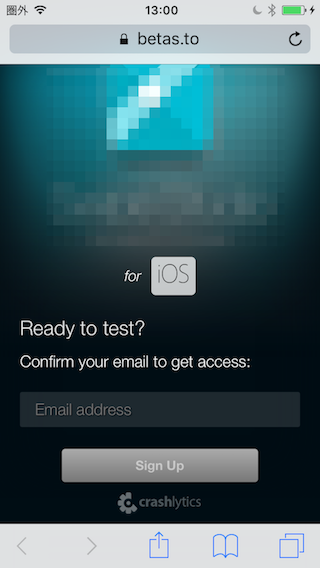
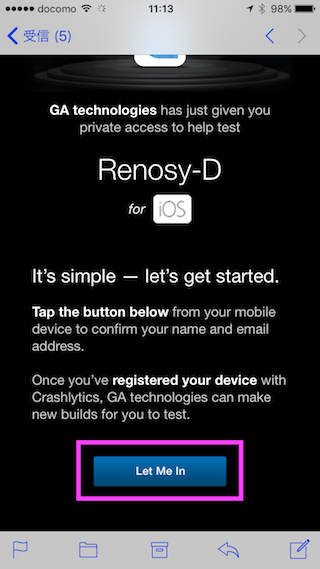
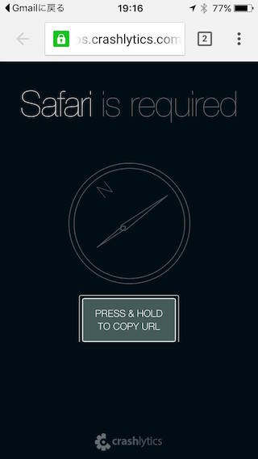
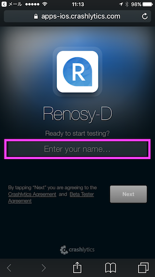
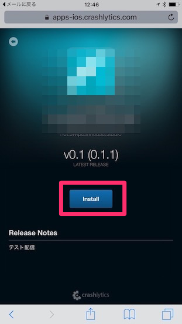
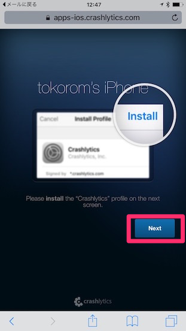
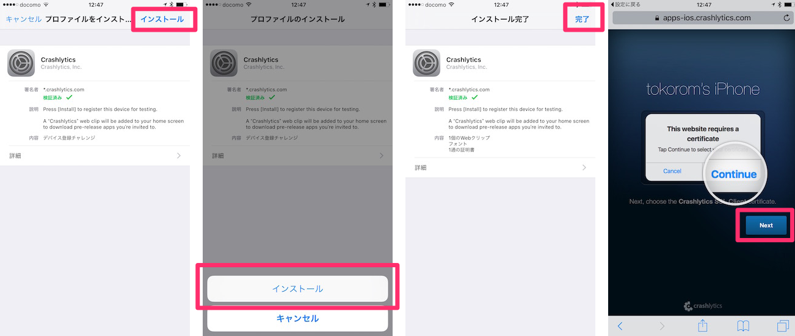

# Fabric Betaからのアプリのインストール方法

Fabric Betaを利用することで、リリース前のテスト版アプリをご自身のiPhoneにインストールしていただけます。

#### ※ここでインストールするアプリは、App Storeでインストールするものとは異なるものです。

#### 対象OSはiOS10.0以上です。

以下の手順でインストールを行ってください。

#### はじめてこの手順でインストールされる場合は、まず4まで行ってください。
4まで行っていただきますと、こちらでAppleに端末情報を登録し、アプリを再配信致します。

### 1. 共有したURLをiPhoneからクリックします。

下記の画面が開くので、 `Email address` の欄に、お使いのiPhoneで受信できるメールアドレスを入力します。

* `Email address` の欄にあなたのメールアドレスを入力します。 （今後、このアドレスにバージョンアップの通知が送られます）
* `Sign Up` ボタンをタップ

してください。

少し待つと、入力したメールアドレスに招待メールが届くはずです。

### 2. 「Let Me In」を押します。

※GmailでリンクはSafariで開く必要があります。

よくある例としてiPhone標準のメールアプリでなくGmailなどを使っている場合、Crashlyticsからのメールのリンク（ボタン）をタップした時にSafariでなくChromeなどで開いてしまうことがあります。

その場合、上記のように英語で「Safariで開く必要があります。URLをコピーしてSafariで開いてください。」というメッセージが表示されていると思いますので、その通り、同じURLをSafariで開いてみてください。

### 3. 名前の入力

すると、上記の名前の入力をする画面が表示されますので、

* Enter your name... 欄に名前を入力
* Next ボタンをタップ
してください。

### 4. Installを押します。

上記Installを押してください。

### 5. （初回のみ）プロファイルのインストール

`Install` ボタンをタップして少し待つと、

と表示されますので、 `Next` で次に進んでください。

以降、 `インストール` > `インストール` > `完了` > `Next` と順に進めていただくだけで大丈夫です。

この後、インストール画面に戻りますので、Installボタンからインストールしてください。

### 6. インストールされたアプリアイコンをタップ

ホーム画面にインストールされたアプリがありますので、タップして開くとアプリが起動します。
